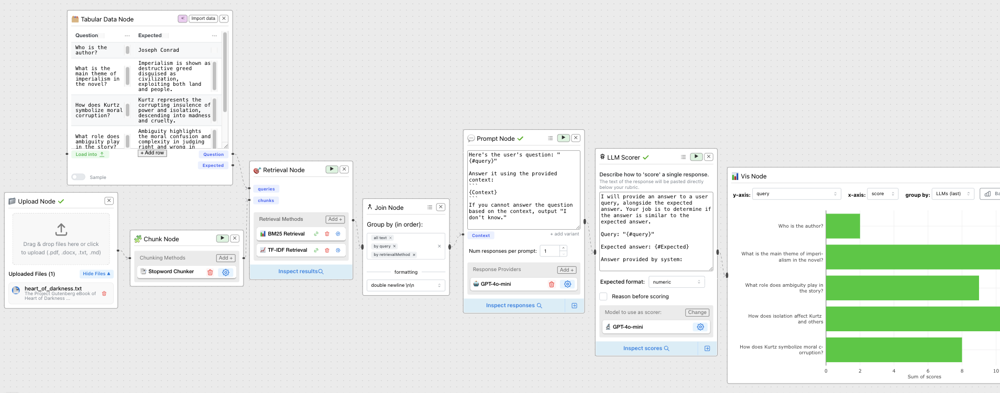

# Conception

## Architecture

- Le système suit une architecture de pipeline linéaire intégrée à l'environnement visuel de ChainForge.Le flux de données traverse les étapes suivantes : Uploading → Chunking → Retrieval → Reranking (optionnel) → Output.

## Choix technologiques

- Frontend : Utilisation de l'interface visuelle à base de nœuds de ChainForge pour permettre aux utilisateurs de "chaîner" les étapes RAG. Langage: React
- Backend : Intégration de bibliothèques de traitement de texte pour gérer la segmentation (chunking) et l'indexation nécessaires au RAG. Langage: Python (Flask)

## Prototype

