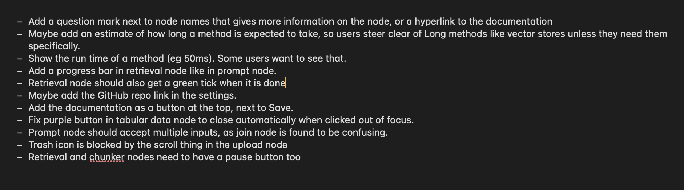

# Résultats

## Fonctionnalités

- Pipeline RAG complet : Implémentation réussie des nœuds permettant l'upload, le chunking, le retrieval et le reranking au sein de l'interface.
- Comparaison Multi-LLM : Conservation de la fonctionnalité clé de ChainForge, permettant de comparer les sorties de plusieurs modèles dans un même contexte enrichi.
- Traçabilité : Exposition des résultats intermédiaires pour permettre le débogage et l'analyse de l'impact des documents récupérés.

## Démonstration
Le capture d'ecran de mes notes concernant les resultats de l'etude:

